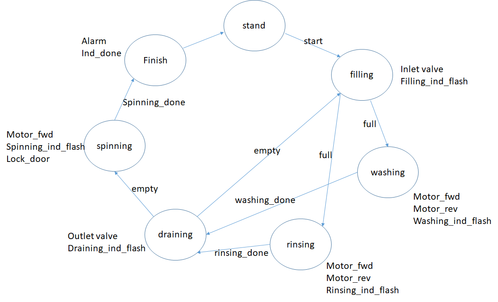
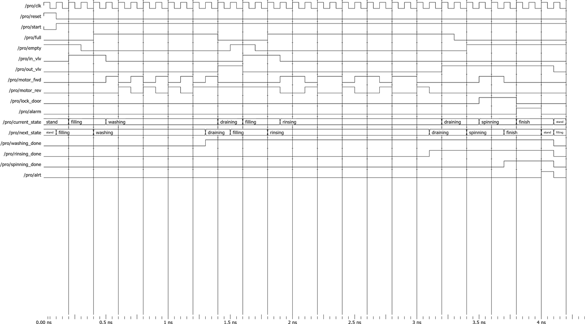

# Washing Machine 
## Introduction
This project will imitate the behaviour of a washimg machine using modelsim.

## FSM

### Sensors
- full (at the top)
- empty (at the bottom)

### Outputs
- Inlet valve
- Outlet valve
- Alarm
- Motor forward
- Motor Reverse
- Lock door

### Timers
- washing
- Rinsing 
- Spinning
- alarm

## Simulation Results

## Future Enhancements
- Different washing modes
- Able to adjust washing time and rinsing times
- Fill tub to different levels
- Heating 
- Modify spinning speed

## Author
Baraah
